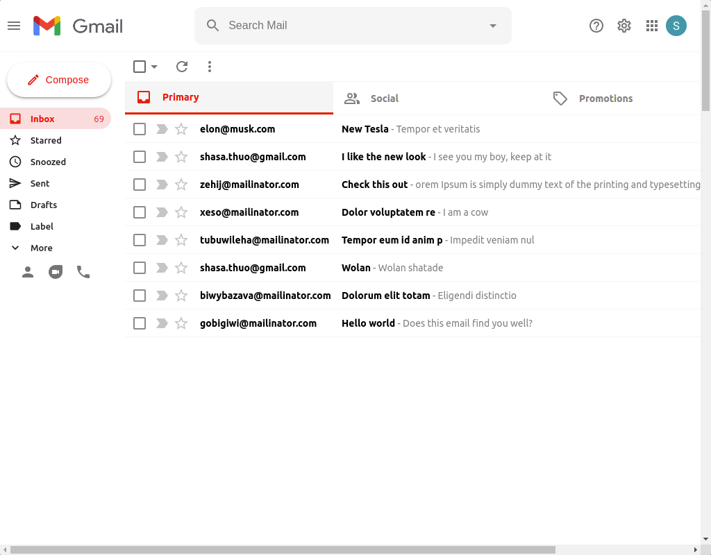

# A Gmail clone built with react

## Technologies used

- React
- Redux
- Firebase/Firestore v9
- Material UI
- React Hook Form

Log in via google authentication, create messages by clicking on compose,
messages will be sent to firestore and appear in the email list. 

Interface achieved via flexbox and material UI

## Live site
https://clone-8e163.web.app 

## Screenshot

